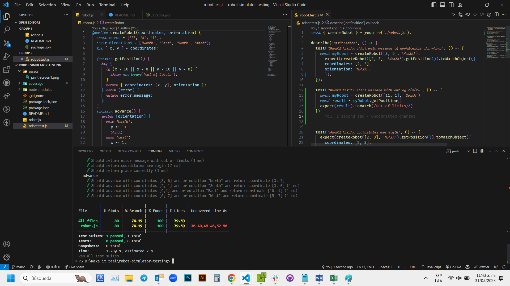

# Make It Real - Robot Simulator Testing

## This is a solution to the _robot simulator testing_ mission of the Make It Real course.

## The challenge

create a robot simulator and test it

## Print screen

## My process

### Built with

- Semantic markup using vscode editor
- VS code
- Jest Library

## What I learned

I practice how to test a js program

## Author

Juan David Peña
github - @juandape
email - juandavidp76@hotmail.com

## Acknowledgments

Thanks to Make it Real to show me a path to become a better programmer
